# AkalaBeth

This is where it all started; a little mini Ultima. Because this was written in Basic, there are a lot of variations floating around the net. The most common change was to modify the Magic Amulet. I believe the listing that I have included here is original.

The dungeons are almost the same as what ended up in Ultima. Each level is a 10x10 and the first 3 monsters were put on the first level. Second level has 4, the third has 5, and so forth. Also, the Giant Rat that you meet on the first level has even more hit points on the second! By the time you hit the 8th level you have stuff attacking you from all directions!

# Screen Shots

## STARTUP1 GIF

First screen after you start the program. Lucky number is used to seed the random number generator for world and dungeon layouts. Level of play, makes monsters harder.

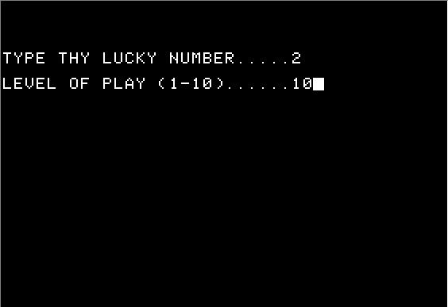

## STARTUP2 GIF

Next your attributes are generated. You just hit "N" until you see number you like. Then you choose to be a fighter or mage. Fighters can use the magic amulet but can't control what it does while a mage can't use rapiers or bows.
STARTUP3
## Welcome to Aklabeth screen. Shows this while generating world.

## OUTSIDE GIF

The world is a 20x20 grid. When you are outside, you can see
your square and all adjacent squares. You are the "+" in the middle. To the south is the symbol for a town. To the west is the symbol for a castle. SW is a mountain and NE (the 'X') is a dungeon. The entire perimeter of the 20x20 grid is surrounded by mountains.

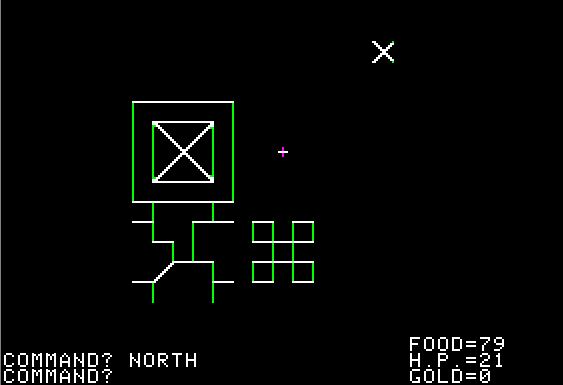

## TOWN GIF

When you enter a town, you go immediately to the store. Here
you stock up on the necessities. When you exit the store,
you also exit the town. This screen also doubles as your
status screen.

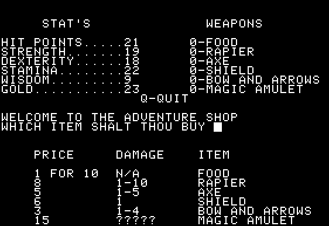

## LB-1 GIF

This is the message the first time you enter Lord British's
Castle. He askes you your name and puts you on a quest. The
first quest is in direct relation to your wisdom level.

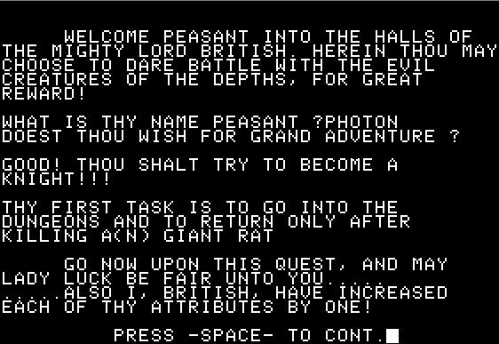

## LB-2 GIF

After completing you quest, Lord British sends you on another. Each new quest is harder than the previous. The very last quest is the Balrog quest.

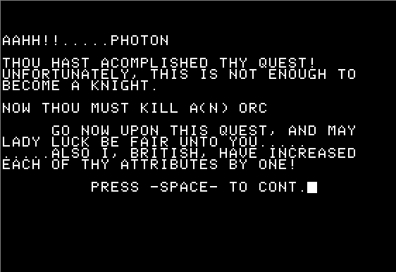

## LB-3 GIF

After completing the last quest, Lord British makes you
a Lord and then encourages you to try the next difficulty
level. If you completed it while at level 10, he give you
a number to call to report thy feat!

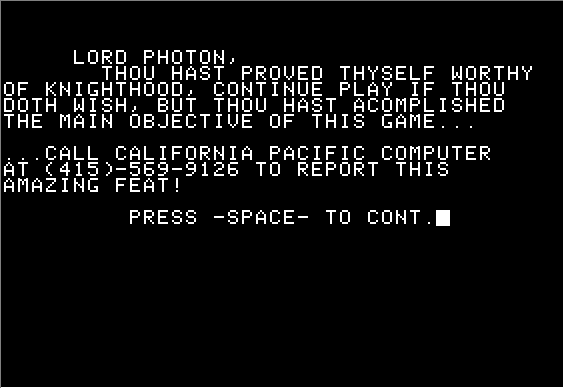

# Monsters _(in order of difficulty)_

## Skeleton

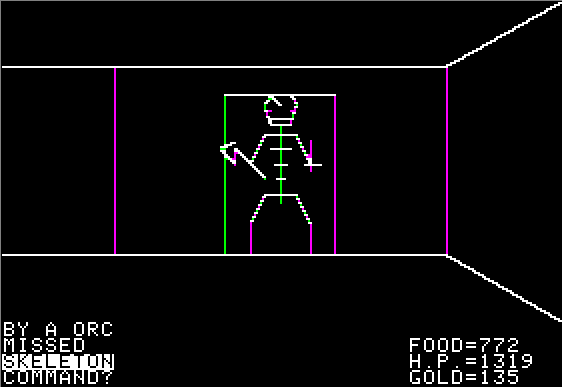

## Thief

(50% chance he will steal _any_ item from you including the weapon you are using!)

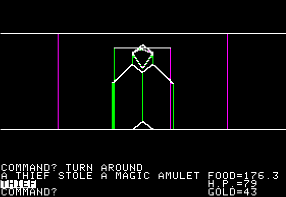

## Giant Rat

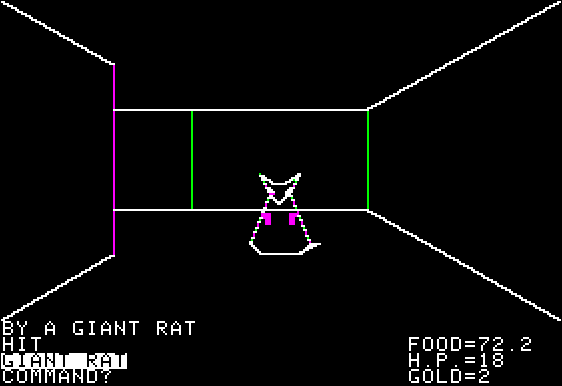

## Orc

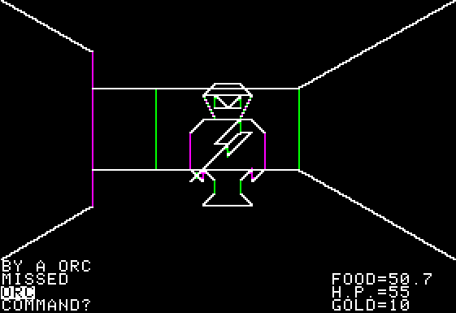

## Viper

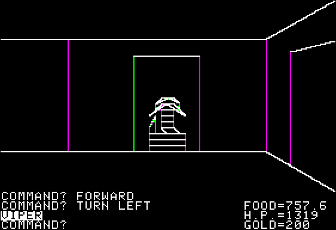

## Carrion Crawler

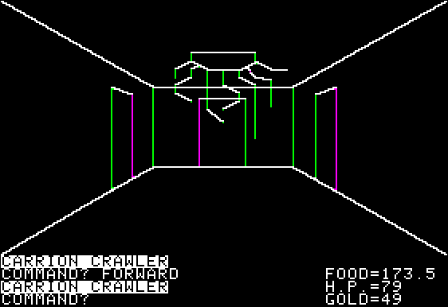

## Gremlin

50% chance that he will eat half your food each turn!

## Mimic

(will actually sit still in distance to get you to go to him)

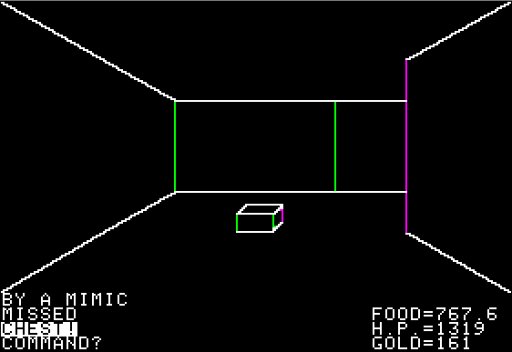

## Daemon

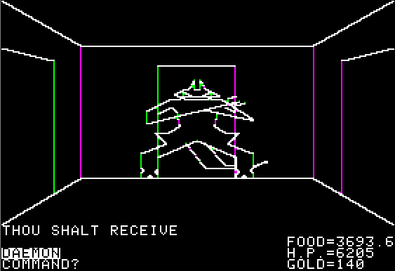

## Balrog

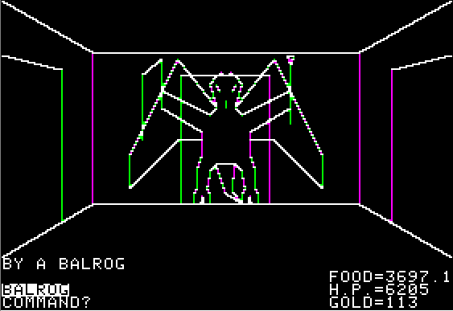

## CHEST

In the dungeons, you may find chests containing gold and
weapons.
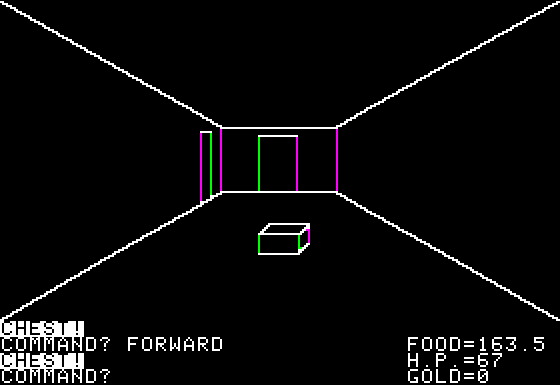

## HID-TRAP GIF

Down at the end of this corridor, an Orc waites. Normally, he comes to you, but not this time? Why? Because there is an invisible trap door in front of him that he is trying to lure you to, thus dropping you an unexpected level! This nasty feature was also in the original Ultima on the Apple II. It seems to me that they removed this in the rewrite though.
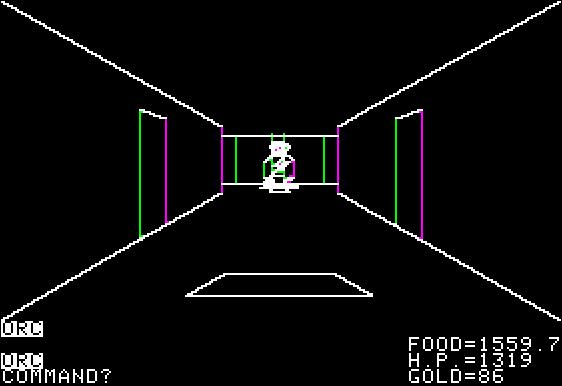

# Addition Files

## AKLABETH TXT

The original Applesoft source, for the curious. Who knows,
maybe someone will want to make a PC version?
[Akakabeth.TXT](AKLABETH.TXT)

## RPG.TXT

A short bit on how I first got interested in RPG's.
[RPG.TXT](RPG.TXT)

# Notes

**Worst Nightmare Situation** - Getting attacked deep in the dungeon simultaneously by both Nightmare a Gremlin and a Thief. Each turn, while the Gremlin is Situation cutting your food supply in half, the Thief is stealing all of your weapons, including the weapon that you are using!

**Neat Feature** - Monsters retreating when critically hurt. Then you have to Feature chase them to finish them off. This feature wouldn't reappear again until Ultima II.

**Badly Needed Feature** - There is no save game option. If you get fed up, you have to start all over again.
