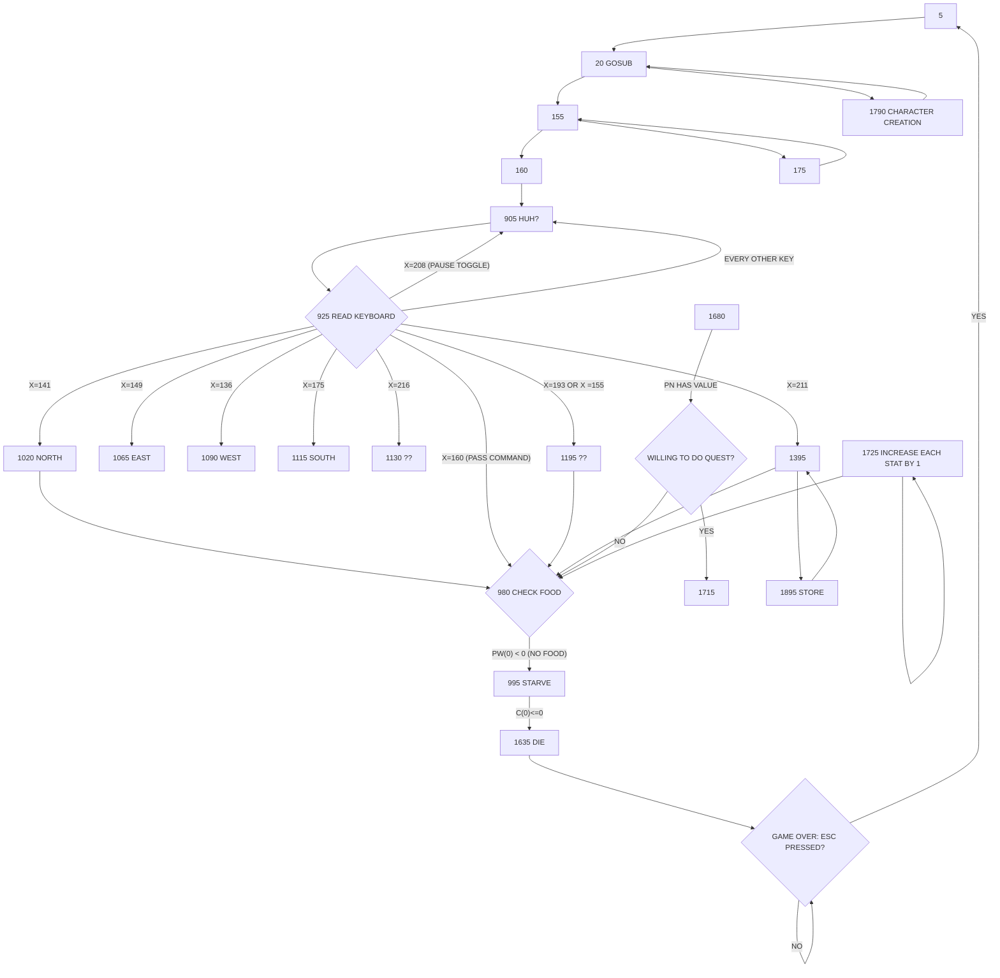

# AKALABETH PROGRAM FLOW

```mermaid
graph
5-->20
20[20 GOSUB]-->1790
1790[1790 CHARACTER CREATION]-->20
20-->155-->175
175-->155
155-->160-->905[905 GET COMMAND]
905-->925{925 READ KEYBOARD}
925-->|X=141|1020[1020 NORTH]
1020-->980
925-->|X=149|1065[1065 EAST]
925-->|X=136|1090[1090 WEST]
925-->|X=175|1115[1115 SOUTH]
925-->|X=216|1130[1130 ??]
925-->|X=193 OR X =155|1195[1195 ??]
925-->|"X=160 (PASS COMMAND)"|980
925-->|"X=211"|1395
925-->|"X=208 (PAUSE TOGGLE)"|905
925-->|"EVERY OTHER KEY"|905[905 HUH?]
980-->|"PW(0) < 0 (NO FOOD)"|995[995 STARVE]
995-->|"C(0)<=0"|1635[1635 DIE]
1195-->980{980 CHECK FOOD}
1395-->1895[1895 STORE]
1895-->1395
1395-->980
1635-->1670
1670{GAME OVER: ESC PRESSED?}-->|"YES"|5
1670-->|"NO"|1670
1680-->|PN HAS VALUE|1705{WILLING TO DO QUEST?}
1705-->|"NO"| 980
1705-->|"YES"|1715
1725-->1725
1725[1725 INCREASE EACH STAT BY 1]--> 980
```
