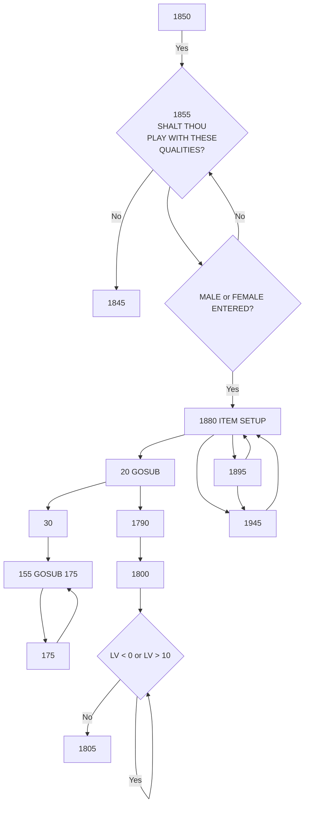

# AKALABETH PROGRAM FLOW

```mermaid
graph
20[20 GOSUB]-->1790
1790-->1800-->1795{LV < 0 or LV > 10}-->|Yes|1795
1795-->|No|1805
1855{1855\n SHALT THOU\n PLAY WITH THESE\n QUALITIES?}-->|No|1845
1850-->|Yes|1855
1855-->1860{MALE or FEMALE ENTERED?}-->|Yes|1880
1860-->|No|1855
1880[1880 ITEM SETUP]-->1895
1895-->1880
1880-->1945
1945-->1880
1895-->1945
1880-->20
20-->30
30-->155[155 GOSUB 175]
155-->175
175-->155


```
